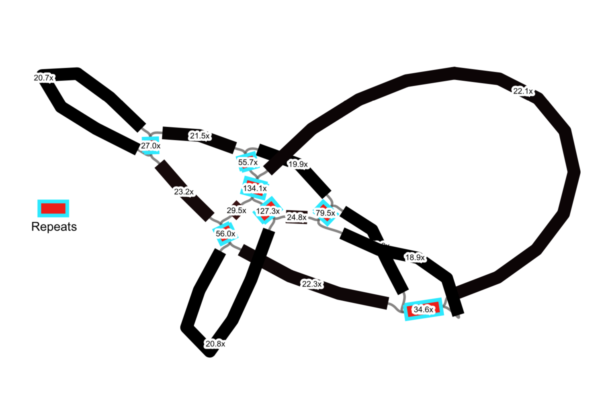

# Mitochondrial genome assembly

1. Reads were mapped to the plastid assembly using end-to-end alignment in Bowtie:
```
bowtie2-build reference_plastid_genome.fas reference_chl
bowtie2 --end-to-end --fast -x reference_chl -1 forward.R1.fq -2 reverse.R2.fq -S my_species.sam > my_species.bowtie.log 2>&1
```
Reads with 100% sequence similarity and >98% sequence overlap with the plastid assemblies were filtered prior to the assembly using `filter_pt_reads.py`
2. Mitochondrial genomes were assembled using GetOrganelle using the following commands:
```
get_organelle_from_reads.py -1 forward.fq -2 reverse.fq -o mitochondria_output -R 20 -k 65,85,105 -P 1000000 -F embplant_mt
```
3. The resulting De Bruijn assembly graphs was visualized in Bandage and manually curated to generate the final assembly.

# Mitochondrial gene annotation

Annotations of mitochondrial genomes were conducted on the web-based GeSeq under default settings. The resulting GenBank formatted annotation was inspected and curated in Geneious Prime 2019.1.3 (Biomatters Ltd, Auckland, New Zealand, http://www.geneious.com/)

# Repeat annotation
1. Use `ROUSFinder2.0.py` to identify repeat with size >15 bp. The batch file to execute it across all species is `ROUSFinder_batch.sh`

ROUSFinder will incorrectly identify long single-copy sequences as repeats somehow. Use `summarize_ROUSfinder_result.sh` to remove these and calculate the total size of repeats.

2. de bruijn assembly graph based repeat identification

(1) Criteria for repeat identification: a. have >= 4 edges in de bruijn graph; b. present in the final assembly that is manually curated; c. >~1.5 x kmer coverage than the whole-graph average

(2) First get a list of contig included in the final assembly
```
grep '^L' Alectra_sessiflora_LM143.gfa | awk '{print $2,$4}' | sed 's/_/\'$'\n/g' | sed 's/ /\'$'\n/g' >Alectra_sessiflora_LM143.scaffold.list
grep '^L' Aphyllon_fasciculatum.gfa | awk '{print $2,$4}' | sed 's/_/\'$'\n/g' | sed 's/ /\'$'\n/g' >Aphyllon_fasciculatum.scaffold.list
grep '^L' Aphyllon_purpureum.gfa | awk '{print $2,$4}' | sed 's/_/\'$'\n/g' | sed 's/ /\'$'\n/g' >Aphyllon_purpureum.scaffold.list
grep '^L' Aureolaria_grandiflora_LM037.gfa | awk '{print $2,$4}' | sed 's/_/\'$'\n/g' | sed 's/ /\'$'\n/g' >Aureolaria_grandiflora_LM037.scaffold.list
grep '^L' Bartsia_inaequalis_LM033.gfa | awk '{print $2,$4}' | sed 's/_/\'$'\n/g' | sed 's/ /\'$'\n/g' >Bartsia_inaequalis_LM033.scaffold.list
grep '^L' Bellardia_latifolia_LM121.gfa | awk '{print $2,$4}' | sed 's/_/\'$'\n/g' | sed 's/ /\'$'\n/g' >Bellardia_latifolia_LM121.scaffold.list
grep '^L' Brandisia_kwangsiensis_LM122.gfa | awk '{print $2,$4}' | sed 's/_/\'$'\n/g' | sed 's/ /\'$'\n/g' >Brandisia_kwangsiensis_LM122.scaffold.list
grep '^L' Castilleja_indivisa_LM001.gfa | awk '{print $2,$4}' | sed 's/_/\'$'\n/g' | sed 's/ /\'$'\n/g' >Castilleja_indivisa_LM001.scaffold.list
grep '^L' Centranthera_chevalieri_LM117.gfa | awk '{print $2,$4}' | sed 's/_/\'$'\n/g' | sed 's/ /\'$'\n/g' >Centranthera_chevalieri_LM117.scaffold.list
grep '^L' Conopholis_alpina_LM013.gfa | awk '{print $2,$4}' | sed 's/_/\'$'\n/g' | sed 's/ /\'$'\n/g' >Conopholis_alpina_LM013.scaffold.list
grep '^L' Conopholis_americana_LM096.gfa | awk '{print $2,$4}' | sed 's/_/\'$'\n/g' | sed 's/ /\'$'\n/g' >Conopholis_americana_LM096.scaffold.list
grep '^L' Epifagus_virginiana_LM036.gfa | awk '{print $2,$4}' | sed 's/_/\'$'\n/g' | sed 's/ /\'$'\n/g' >Epifagus_virginiana_LM036.scaffold.list
grep '^L' Escobedia_crassipes_LM051.gfa | awk '{print $2,$4}' | sed 's/_/\'$'\n/g' | sed 's/ /\'$'\n/g' >Escobedia_crassipes_LM051.scaffold.list
grep '^L' Euphrasia_cuspidata_LM030.gfa | awk '{print $2,$4}' | sed 's/_/\'$'\n/g' | sed 's/ /\'$'\n/g' >Euphrasia_cuspidata_LM030.scaffold.list
grep '^L' Harveya_capensis.gfa | awk '{print $2,$4}' | sed 's/_/\'$'\n/g' | sed 's/ /\'$'\n/g' >Harveya_capensis.scaffold.list
grep '^L' Hyobanche_sanguinea_LM077.gfa | awk '{print $2,$4}' | sed 's/_/\'$'\n/g' | sed 's/ /\'$'\n/g' >Hyobanche_sanguinea_LM077.scaffold.list
grep '^L' Kopsiopsis_strobilacea_LM081.gfa | awk '{print $2,$4}' | sed 's/_/\'$'\n/g' | sed 's/ /\'$'\n/g' >Kopsiopsis_strobilacea_LM081.scaffold.list
grep '^L' LM121.gfa | awk '{print $2,$4}' | sed 's/_/\'$'\n/g' | sed 's/ /\'$'\n/g' >LM121.scaffold.list
grep '^L' Lathraea.gfa | awk '{print $2,$4}' | sed 's/_/\'$'\n/g' | sed 's/ /\'$'\n/g' >Lathraea.scaffold.list
grep '^L' Lindenbergia_grandiflora_LM085.gfa | awk '{print $2,$4}' | sed 's/_/\'$'\n/g' | sed 's/ /\'$'\n/g' >Lindenbergia_grandiflora_LM085.scaffold.list
grep '^L' Mannagettaea_hummelii_LM093.gfa | awk '{print $2,$4}' | sed 's/_/\'$'\n/g' | sed 's/ /\'$'\n/g' >Mannagettaea_hummelii_LM093.scaffold.list
grep '^L' Melasma_hispidum_LM109.gfa | awk '{print $2,$4}' | sed 's/_/\'$'\n/g' | sed 's/ /\'$'\n/g' >Melasma_hispidum_LM109.scaffold.list
grep '^L' Monochasma_japonicum_LM161.gfa | awk '{print $2,$4}' | sed 's/_/\'$'\n/g' | sed 's/ /\'$'\n/g' >Monochasma_japonicum_LM161.scaffold.list
grep '^L' Odontites_serotina_LM136.gfa | awk '{print $2,$4}' | sed 's/_/\'$'\n/g' | sed 's/ /\'$'\n/g' >Odontites_serotina_LM136.scaffold.list
grep '^L' Orobanche_austrohispanica_LM103.gfa | awk '{print $2,$4}' | sed 's/_/\'$'\n/g' | sed 's/ /\'$'\n/g' >Orobanche_austrohispanica_LM103.scaffold.list
grep '^L' Orobanche_cooperi_LM014.gfa | awk '{print $2,$4}' | sed 's/_/\'$'\n/g' | sed 's/ /\'$'\n/g' >Orobanche_cooperi_LM014.scaffold.list
grep '^L' Orobanche_crenata_LM102.gfa | awk '{print $2,$4}' | sed 's/_/\'$'\n/g' | sed 's/ /\'$'\n/g' >Orobanche_crenata_LM102.scaffold.list
grep '^L' Orobanche_dugesii_LM098.gfa | awk '{print $2,$4}' | sed 's/_/\'$'\n/g' | sed 's/ /\'$'\n/g' >Orobanche_dugesii_LM098.scaffold.list
grep '^L' Orobanche_fasciculata_LM020.gfa | awk '{print $2,$4}' | sed 's/_/\'$'\n/g' | sed 's/ /\'$'\n/g' >Orobanche_fasciculata_LM020.scaffold.list
grep '^L' Orobanche_foetida_LM101.gfa | awk '{print $2,$4}' | sed 's/_/\'$'\n/g' | sed 's/ /\'$'\n/g' >Orobanche_foetida_LM101.scaffold.list
grep '^L' Orobanche_ludoviciana_LM016.gfa | awk '{print $2,$4}' | sed 's/_/\'$'\n/g' | sed 's/ /\'$'\n/g' >Orobanche_ludoviciana_LM016.scaffold.list
grep '^L' Orobanche_minor_LM097.gfa | awk '{print $2,$4}' | sed 's/_/\'$'\n/g' | sed 's/ /\'$'\n/g' >Orobanche_minor_LM097.scaffold.list
grep '^L' Orobanche_pinorum_LM099.gfa | awk '{print $2,$4}' | sed 's/_/\'$'\n/g' | sed 's/ /\'$'\n/g' >Orobanche_pinorum_LM099.scaffold.list
grep '^L' Orobanche_ramosa_LM019.gfa | awk '{print $2,$4}' | sed 's/_/\'$'\n/g' | sed 's/ /\'$'\n/g' >Orobanche_ramosa_LM019.scaffold.list
grep '^L' Orthocarpus_attenuatus_LM105.gfa | awk '{print $2,$4}' | sed 's/_/\'$'\n/g' | sed 's/ /\'$'\n/g' >Orthocarpus_attenuatus_LM105.scaffold.list
grep '^L' Pedicularis_attollens_LM040.gfa | awk '{print $2,$4}' | sed 's/_/\'$'\n/g' | sed 's/ /\'$'\n/g' >Pedicularis_attollens_LM040.scaffold.list

```

(3) Then use the script `de_bruijn_graph_based_repeat_identification.py` to identify candidate repeat based on the number of connections in the de bruijn graph and presence in the final assembly. The output `repeat_candidate.tsv` includes the kmer coverage and length for each candidate contig as well as the coverage for immediate neighbour contigs.



This is a de bruijn assembly graph. The highlighted contigs in red satisfy the criteria defined in (1).

(4) Manually inspected the length, coverage of candidate repeats in the spreadsheet. Then extract the sequences in fasta format.

(5) Blast the repeat sequences against plastid assemblies using `repeat_pt_blast.sh`, then remove sequences overlap >95% with plastomes.

(6) Do an all-by-all blast for all repeat sequences and use `repeat_class_claster_plot.R` to identify repeat clusters.

# Synteny

Pairwise genome alignment was conducted with Mummer v4.0 and visualized with dotPlotly
```
nucmer -p AH --maxmatch -g 1000 -b 1000 Rehmannia_glutinosa.fas Aeginetia_indica.fas 
show-coords -c AH.delta > AH.coords
./dotPlotly/mummerCoordsDotPlotly.R -i AH.coords -o AH -t -m 50 -q 500 -l -p 5
```
The complete script to run mummer on cluster is available in `Synteny_analysis.sh`.

To summarize the total length of sequences in synteny with the reference Rehmannia_glutinosa, use `mummer_sum.sh` to process *.coords files.
