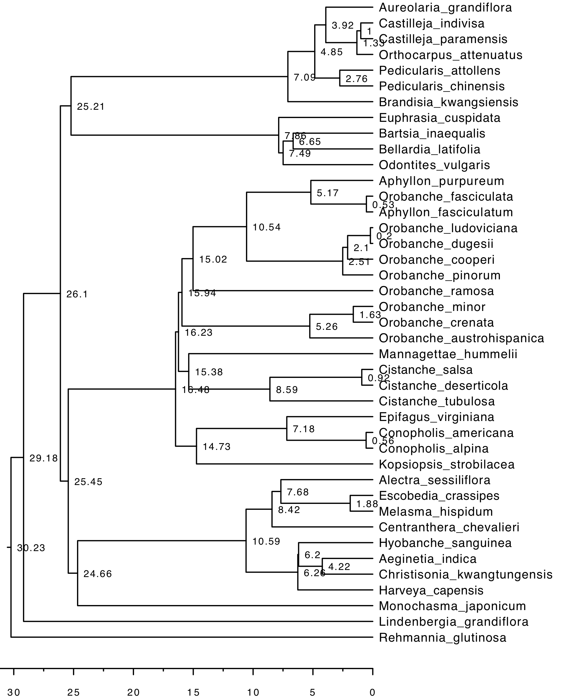

# Comparative hypothesis testing: Phylogenetic ANOVA and PGLS analysis

## Divergence time estimation

1. Orobanchaceae

The age of six key nodes was fixed based on Mortimer et al 2022. TreePL was run three times to prime, cross validate, and thoroughly search for the optimal time tree. Configuration file can be found in `treePL.in.txt`. The output ultrametric tree is `round3.mt37g_42sp.treePL.tre`.

2. Heterotrophic angiosperms

List of 19 species was uploaded to timetree 5 (https://timetree.org/) to generate an ultrametric tree `heterotrophic_angiosperm`. Time tree consolidates age estimates from literature to generate a dated phylogeny for selected species.

## Hypothesis testing with phylogenetic ANOVA and PGLS

The input data matrix is available in `hemiholo_traits.csv`. The statistical analysis is completed using `PGLS_phylAnova.R`.
